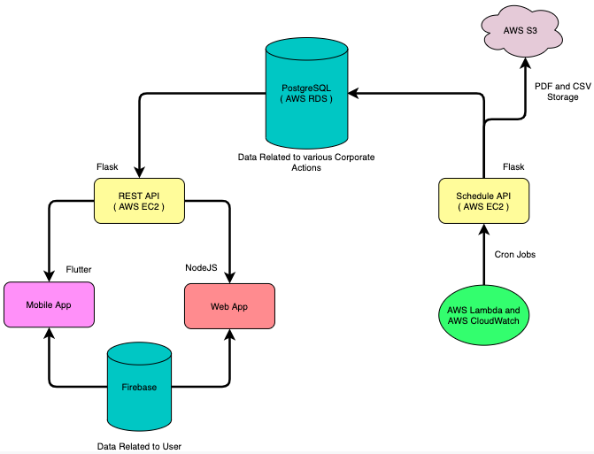
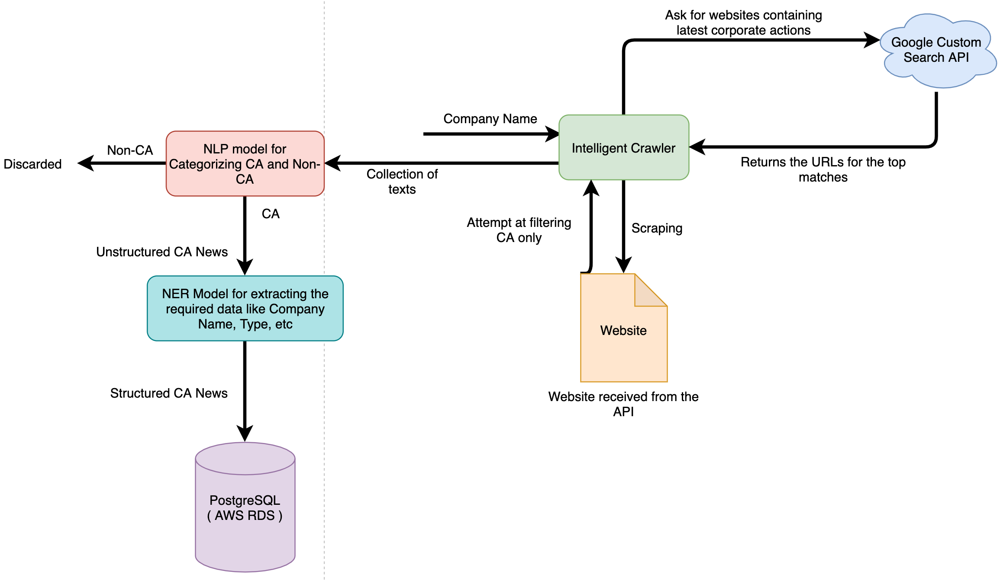

# SIH 2020

**Problem Statement : SM445**

**Team : Anton3.0**

---

### Table of Contents

- [ Introduction ](#introduction)
- [ Our Solution ](#solution)
  - [ Overview](#overview)
  - [ Features](#features)
  - [ Architecture](#architecture)
- [ Technology Stack](#techstack)
  - [ Flutter](#flutter)
  - [ NodeJS and EJS](#node)
  - [ Spacy](#spacy)
  - [ Flask](#flask)
  - [ PostgreSQL](#pgsql)
  - [ AWS](#aws)
- [ Installation](#installation)
- [ User Interface](#smpout)
- [ Our Team](#team)

---

<a name="introduction" />

### Introduction

A corporate action is an event initiated by a public company that will bring an actual change to the securities—equity or debt—issued by the company. Corporate actions are typically agreed upon by a company's board of directors and authorized by the shareholders. Examples of corporate actions include stock splits, dividends, mergers and acquisitions, rights issues, and spin-offs. Corporate action instantly impacts security valuation and hence its timely and accurate information is very critical to financial institutes and investors. Information on current, upcoming, and historical corporate action can be purchased from various data vendors like Bloomberg, ICE Data Service, Refinitiv, MarketMap, etc. which could be expensive. Alternatively, data could be freely retrieved from public webpages and company portal. Challenge with free data approach is its accuracy, reliability and completeness

**Goal** of corporate action (CA) robot is to retrieve accurate, and complete information on historical, current, and future expected corporate action in timely manner from free sources.

---

<a name="solution" />

### Our Solution

<a name="overview">

#### Overview

<a name="features">

#### Features

- [x] Capability of crawling public web pages to retrieve information related to historical, current, and future expected corporate action
- [x] Data can be viewed on a mobile platform or a web platform
- [x] Download the data as pdf or csv
- [x] Ability of process information available in free text format like pdf, and MS word document
- [x] Intelligently identify context in which data is available, like is it listed as example, or is it a real announced corporate action. We should also be able to classify CA as approved or yet to be approved corporate action.
- [x] Extract important information from retrieved pages/files on corporate action
- [x] Build accurate, and complete data from conflicting data retrieved from multiple sources. It can continuously learn about sources which could be trusted for specific information
- [x] Ability to configure to look for CA on a set of securities, to all listed securities on specific exchange.
- [x] Robot could be configured to continuously look for new data available for relevant corporate action.

<a name="architecture">

#### Architecture

Overview of our architecture



Architecture for Data Source



---

<a name="techstack" />

### Technology Stack

<a name="flutter">

#### Flutter

<a name="node">

#### NodeJS and EJS

<a name="spacy">

#### Spacy

<a name="pgsql">

#### PostgreSQL

<a name="aws">

#### AWS

---

<a name="installation" />

### Installation

#### Starting the servers

1. Clone this repository

```sh
foo@bar:~$ git clone https://github.com/Anton-3-0-SIH2020/SIH2020_SM445_Team_Anton_3.0.git
```

2. Change directory to that folder

```sh
foo@bar:~$ cd SIH2020_SM445_Team_Anton_3.0/
```

3. Run the setup file

```sh
foo@bar:~$ sh setup.sh
```

3. Starting the scheduled task api

```sh
foo@bar:~$ cd SchedulerAPI/
foo@bar:~$ source env/bin/activate
foo@bar:~$ python3 app.py
foo@bar:~$ deactivate
```

The TaskSchedulerAPI will run on localhost:8000. If you want the BASE_URL to be different then,

```sh
foo@bar:~$ export BASE_URL=<URL GOES HERE>
foo@bar:~$ python3 app.py
```

3. Open another terminal. ( You may close this terminal however if you have any scheduled jobs setup, then those won't run.
4. Starting the Scheduled Tasks ( Also build the database )

```sh
foo@bar:~$ cd ..
foo@bar:~$ cd ScheduledTask/
foo@bar:~$ cd BSE/
foo@bar:~$ source env/bin/activate
foo@bar:~$ python3 app.py
foo@bar:~$ deactivate
```

```sh
foo@bar:~$ cd ..
foo@bar:~$ cd NSE/
foo@bar:~$ source env/bin/activate
foo@bar:~$ python3 app.py
foo@bar:~$ deactivate
```

```sh
foo@bar:~$ cd ..
foo@bar:~$ cd MoneyControl/
foo@bar:~$ source env/bin/activate
foo@bar:~$ python3 app.py
foo@bar:~$ deactivate
```

5. Start the REST API server

```sh
foo@bar:~$ cd ..
foo@bar:~$ cd ../
foo@bar:~$ cd RESTAPI/
foo@bar:~$ source env/bin/activate
foo@bar:~$ python3 app.py
```

The server will be running on localhost:5000

#### Starting the Web App

#### Starting the Mobile App

---

<a name="smpout" />

### User Interface

---

<a name="team" />

### Our Team

1. -[@BhavikaBajaj](https://github.com/BhavikaBajaj)
2. -[@dxmxnlord](https://github.com/dxmxnlord)
3. -[@Harshalshree](https://github.com/Harshalshree)
4. -[@pratikbaid3](https://github.com/pratikbaid3)
5. -[@Sid200026](https://github.com/Sid200026)
6. -[@Yash-Jain289](https://github.com/Yash-Jain289)

**Mentor**

1. Syed Ibrahim Peer Mohamed
