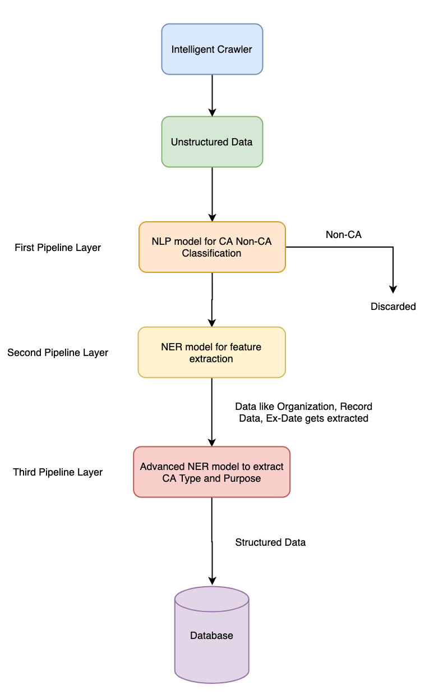
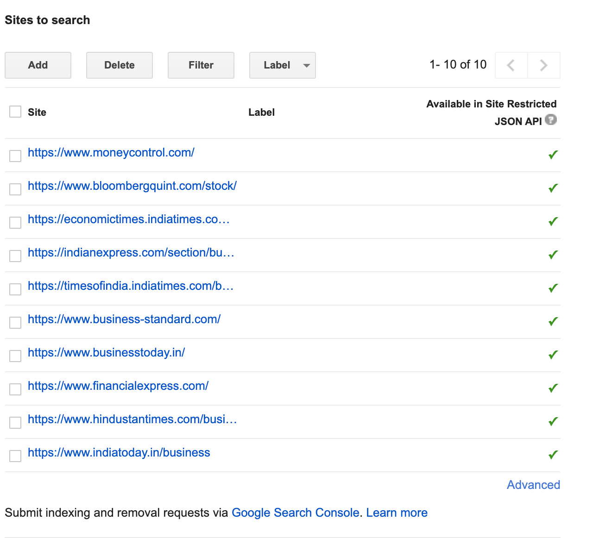
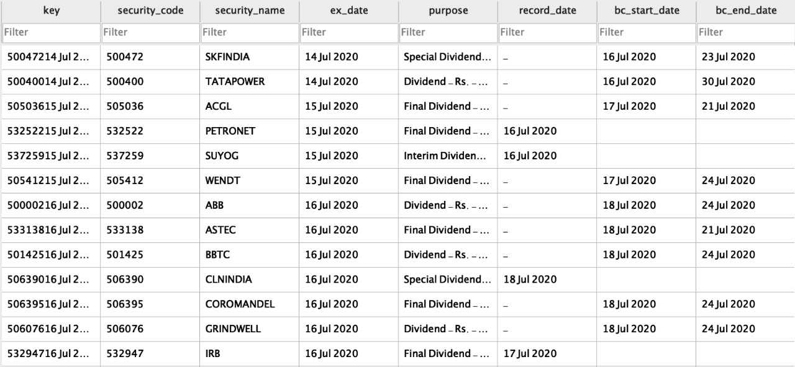

# SIH 2020

**Problem Statement : SM445**

**Team : Anton3.0**

**Participants**
1. Pratik Baid | Vellore Institute of Technology, Chennai | pratikbaid3@gmail.com
2. Rishikesh Sriram | Vellore Institute of Technology, Chennai | rishikesh.sriram06@gmail.com
3. Siddharth Singha Roy | Vellore Institute of Technology, Chennai | siddharthsingha.roy2018@vitstudent.ac.in
4. Bhavika Bajaj | Vellore Institute of Technology, Chennai | bhavikabenigopal.2018@vitstuent.ac.in
5. Yash Jain | Vellore Institute of Technology, Chennai | yashjain.2018@vitstudent.ac.in
6. Harshal Shree | Vellore Institute of Technology, Chennai | harshal.shree2018@vitstudent.ac.in


**Mentor**

1. Syed Ibrahim Peer Mohamed | Vellore Institute of Technology, Chennai

---

### Table of Contents

- [ Introduction ](#introduction)
- [ Prerequisites](#prereq)
- [ Installation](#installation)
- [ Our Solution ](#solution)
  - [ Overview](#overview)
  - [ Features](#features)
  - [ Architecture](#architecture)
- [ Technology Stack](#techstack)
  - [ Flutter](#flutter)
  - [ spaCy](#spacy)
  - [ Flask](#flask)
  - [ PostgreSQL](#pgsql)
  - [ AWS](#aws)
- [ Hosting](#host)
- [ User Interface](#smpout)
- [ Data source for corporate actions](#dsca)

---

<a name="introduction" />

### Introduction

A corporate action is an event initiated by a public company that will bring an actual change to the securities—equity or debt—issued by the company. Corporate actions are typically agreed upon by a company's board of directors and authorized by the shareholders. Examples of corporate actions include stock splits, dividends, mergers and acquisitions, rights issues, and spin-offs. Corporate action instantly impacts security valuation and hence its timely and accurate information is very critical to financial institutes and investors. Information on current, upcoming, and historical corporate action can be purchased from various data vendors like Bloomberg, ICE Data Service, Refinitiv, MarketMap, etc. which could be expensive. Alternatively, data could be freely retrieved from public webpages and company portal. Challenge with free data approach is its accuracy, reliability and completeness

**Goal** of corporate action (CA) robot is to retrieve accurate, and complete information on historical, current, and future expected corporate action in timely manner from free sources.

---

<a name="prereq" />

### Prerequisites

1. [ AWS S3 Instance](https://aws.amazon.com/s3/)

This instance will be used to store the pdf and csv files. Create a bucket named ```smart-india-hackathon```. You'll need to have an access key, secret key, region and bucket name.

2. [ Postgres Server](https://aws.amazon.com/rds/)

You need to have one postgres server running with a database ```sih``` created. Also note the **username**, **password**, **host** and **port**

3. [ Python 3.6+](https://www.python.org/downloads/)

The code base uses features only available from python 3.6

4. [ wkhtmltopdf](https://wkhtmltopdf.org/downloads.html)

This repository uses wkhtmltopdf library to convert html file to pdf.

5. [ Flutter](https://flutter.dev/docs/get-started/install)

Flutter is used to develop the Android and IOS platforms.

6. [ Google Custom Search API](https://developers.google.com/custom-search/v1/overview)

This application uses Google's Custom Search API to decide from which websites it needs to get extract information regarding corporate actions.

7. [ Firebase](https://firebase.google.com/)

Used for storing data regarding the user and also for authentication of users

8. [ Xcode(Only for MacOS)](https://developer.apple.com/xcode/resources/) [This is optional. Install this if you want to run the Flutter app]

Xcode can be used for building the Flutter app for IOS and also run it on an emulator.

9. [ Android Studio(For any OS)](https://developer.android.com/studio) [This is optional. Install this if you want to run the Flutter app]

Android Studio can also be used for building the Flutter app for android and also run it on an emulator.

---

<a name="installation" />

### Installation

#### Starting the servers

1. Clone this repository

```sh
foo@bar:~$ git clone https://github.com/Anton-3-0-SIH2020/SIH2020_SM445_Team_Anton_3.0.git
```

2. Change directory to that folder

```sh
foo@bar:~$ cd SIH2020_SM445_Team_Anton_3.0/
```

3. Run the setup file

```sh
foo@bar:~$ sh setup.sh
```

3. Starting the scheduled task api

```sh
foo@bar:~$ cd SchedulerAPI/
foo@bar:~$ source env/bin/activate
foo@bar:~$ python3 app.py
foo@bar:~$ deactivate
```

The TaskSchedulerAPI will run on localhost:8000. If you want the BASE_URL to be different then,

```sh
foo@bar:~$ export BASE_URL=<URL GOES HERE>
foo@bar:~$ python3 app.py
```

3. Open another terminal. ( You may close this terminal however if you have any scheduled jobs setup, then those won't run.
4. Starting the Scheduled Tasks ( Also build the database )

```sh
foo@bar:~$ cd ..
foo@bar:~$ cd ScheduledTask/
foo@bar:~$ cd BSE/
foo@bar:~$ source env/bin/activate
foo@bar:~$ python3 app.py
foo@bar:~$ deactivate
```

```sh
foo@bar:~$ cd ..
foo@bar:~$ cd NSE/
foo@bar:~$ source env/bin/activate
foo@bar:~$ python3 app.py
foo@bar:~$ deactivate
```

```sh
foo@bar:~$ cd ..
foo@bar:~$ cd MoneyControl/
foo@bar:~$ source env/bin/activate
foo@bar:~$ python3 app.py
foo@bar:~$ deactivate
```

5. Start the REST API server

```sh
foo@bar:~$ cd ..
foo@bar:~$ cd ../
foo@bar:~$ cd RESTAPI/
foo@bar:~$ source env/bin/activate
foo@bar:~$ python3 app.py
foo@bar:~$ cd ..
foo@bar:~$ cd ..
```

The server will be running on localhost:5000

#### Starting the Mobile App

```sh
foo@bar:~$ cd SIH2020_SM445_Team_Anto.3.0_MobileApp/
foo@bar:~$ flutter packages get
foo@bar:~$ flutter package upgrade
foo@bar:~$ flutter run
```

---

<a name="solution" />

### Our Solution

<a name="overview">

#### Overview

We provide an **intelligent crawler** which can extract information related to corporate actions from **every webpage**. The crawler is designed to be able to extract information **without requiring any knowledge of the DOM elements**. So even if a website decides to change its CSS classes, identifiers etc, our crawler will still be able to gather information from that website. We use Google's Custom Search API to gather the sites which have a higher search index and get a list of url's pertaining to a company's corporate action. We then feed these urls to our crawler which returns all the extracted information from this site.

The extracted information may be in a structured format (Table, PDF, Word):


The extracted imformation may be unstructured (News, Free form text):


For the **structured data** we preprocess the data, assign it a key based on the name of the company and store it in the database.
As for the **unstructured data**, information is passed through a **NLP model** to decide whether the given text is CA or Non-CA. The crawler will act as a pseudo pipeline-layer for the NLP model to remove any information that may not be a CA. After a text has been classified as CA, we'll  pass it through a **NER model** to extract information **(Organisation, Date, Ca Type, Purpose, Context, Source)**  from it and store it in the database.

The above steps will be **scheduled to run every 'n' hours** to update the database and get the latest information.

<a name="features">

#### Features

- [x] Capability to crawl **all webpage's** and gather the requisite information regarding corporate actions.
- [x] **Intelegently identify which websites** provide information related to the required corporate action.
- [x] Data can be viewed on a **mobile platform**
- [x] Download the data as **pdf or csv**
- [x] **Extract important information** from retrieved pages/files on corporate action
- [x] **Build accurate, and complete data** from conflicting data retrieved from multiple sources.
- [x] Ability to configure to **look for CA on a set of securities, to all listed securities on specific exchange**.
- [x] Robot could be configured to **continuously look for new data** available for relevant corporate action.
- [x] Add certain set of securities as **favourites**

<a name="architecture">

#### Architecture

**Overview of our architecture**


**Architecture for Data Source ( 1 )**


**Architecture for Data Source ( 2 )**


**NLP Pipeline**



---

<a name="techstack" />

### Technology Stack

<a name="flutter">

#### [ Flutter](https://flutter.dev/)

* Flutter overcomes the traditional limitations of cross-platform approaches.
* Frontend & Backend with a single code
* Flutter moves to a widget, rendering, animation and gestures into this framework to give you to complete control over every pixel on the screen. It means you have the flexibility to build a custom design.

<a name="spacy">

#### [ spaCy](https://spacy.io/)

* spaCy is an industrial grade natural language processing toolkit.
* spaCy excels at large-scale information extraction tasks.
* spaCy is the best way to prepare text for deep learning.

<a name="flask">

#### [ Flask](https://flask.palletsprojects.com/en/1.1.x/)

* Used for developing highly scalable microservices
* It is based on Python and allows ease of integration with ML and NLP applications

<a name="pgsql">

#### [ PostgreSQL](https://www.postgresql.org/)

* Concurrency, Performance, Reliability and Disaster Recovery
* Highly scalable for structured data

<a name="aws">

#### [ AWS](https://aws.amazon.com/)

* Automated Multi-Region Backups
* Consistency & Reliability
* Simple Automated Scheduling
* Security and Scaling
* AWS CloudWatch, AWS S3, AWS Lambda, AWS RDS

---

<a name="host">

### Hosting

The entire project is hosted on AWS. Currently we use the following AWS Services

* **AWS EC2** Instance for hosting the two flask applications. One EC2 instance has its HTTP and HTTPS Port open whereas the the other EC2 instance is hidden from the world and can only be communicated over an VPC and a private API Key
* **AWS RDS** is used for hosting the PostgreSQL Server
* **AWS Lambda** which communicates with the EC2 instance over a VPC to refresh the database
* **AWS Cloudwatch** is used for scheduling the AWS Lambda function calls
* **AWS VPC** for secured cloud communication
* **AWS SES** for email sending

---

<a name="smpout" />

### User Interface

**Landing Page**


**Login Page**


**Dashboard**


**Favourites**


**Detail View of CA**


**Filtering on basis of security**


---

<a name="dsca" />

### Data Source for Corporate Actions

Currently we use **Google's Custom Search API** to search for corporate action of each company and then scrape all the websites as returned by the API.



This part is entirely customizable and one can add as many number of websites they want. Once the data source is given to our intelligent crawler, it will go and scrape that website for any corporate actions information. The crawler has been designed as a DOM independent platform ie. it can be used to scrape any website and return a list of corporate action information it extracted. We used Google's Search Index to decide which sites to scrape as it may contain information pertaining to corporate actions for a company.

Currently the crawler can parse
* Free Text ( without external intervention )
* Tabular Data ( without external intervention )
* Excel ( requires external intervention )
* PDF ( requires external intervention and only in text format )
* API ( requires external intervention )

Data Collection is scheduled to run every 'n' hours which is totally customizable via AWS Cloudwatch.

---


### Data Extraction

We provide an **intelligent crawler** which can extract information related to corporate actions from **every webpage**. The crawler is designed to be able to extract information **without requiring any knowledge of the DOM elements**. So even if a website decides to change its CSS classes, identifiers etc, our crawler will still be able to gather information from that website. We use Google's Custom Search API to gather the sites which have a higher search index and get a list of url's pertaining to a company's corporate action. We then feed these urls to our crawler which returns all the extracted information from this site.

The extracted information may be in a structured format (Table, PDF, Word):


The extracted imformation may be unstructured (News, Free form text):


For the **structured data** we preprocess the data, assign it a key based on the name of the company and store it in the database.
As for the **unstructured data**, information is passed through a **NLP model** to decide whether the given text is CA or Non-CA. The crawler will act as a pseudo pipeline-layer for the NLP model to remove any information that may not be a CA. After a text has been classified as CA, we'll  pass it through a **NER model** to extract information **(Organisation, Date, Ca Type, Purpose, Context, Source)**  from it and store it in the database.

The complete flow of the pipeline is mentioned below:

**Pipeline Layer 1**

**Clacify the text into ca/non-ca:**


**Accuracy of the clacifier:**


**Extract basic informations from text(Company, Date):**


**Extract advanced information from the text(Ca Type,Purpose):**


**Store the data in the database is a structured format:**





